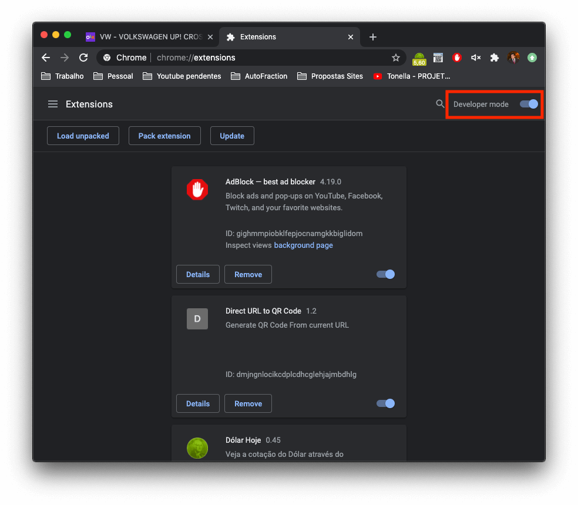

# Extensão do Chrome para inserir Blur nos vídeos da AutoSuper #lista10

### Contexto

Em todos os vídeos do lista10 da AutoSuper, existe uma camada para esconder o nome do vendedor, pra manter a informação do vídeo apenas no contexto do carro e não do vendedor.

### Motivo

1. Em alguns destes vídeos, os editores precisam esconder o perfil enquanto os bobões da AutoSuper scrollam a página, tarefa um tanto complicada e as vezes o nome do vendedor aparece.
2. Outro dia me deu vontade de relembrar como é criar uma extensão para o Chrome, não me pergunte o porque.

### Como funciona: 

Basta clicar no icone da extensão e o perfil do vendedor estará escondido por uma camada de blur, simples assim.

PS: Não publiquei, por ser algo que não vai me retornar nenhum lucro. A ideia é ajudar os editores da AutoSuper, como é algo específico demais e não vou ter usuários para justificar o custo de U$5, achei melhor apenas disponibilizar a extensão para instalação local. =D

### Passos para instalar:
1. Abrir o menu de extensões do chrome e clicar em gerenciar extensões

2. Ativar modo de desenvolvedor, no canto superior direito

3. Arrastar e soltar extensão (arrastar toda a pasta extension, que contém os arquivos necessários para a instalação)

4. Pinar extensão para facilitar o uso.
